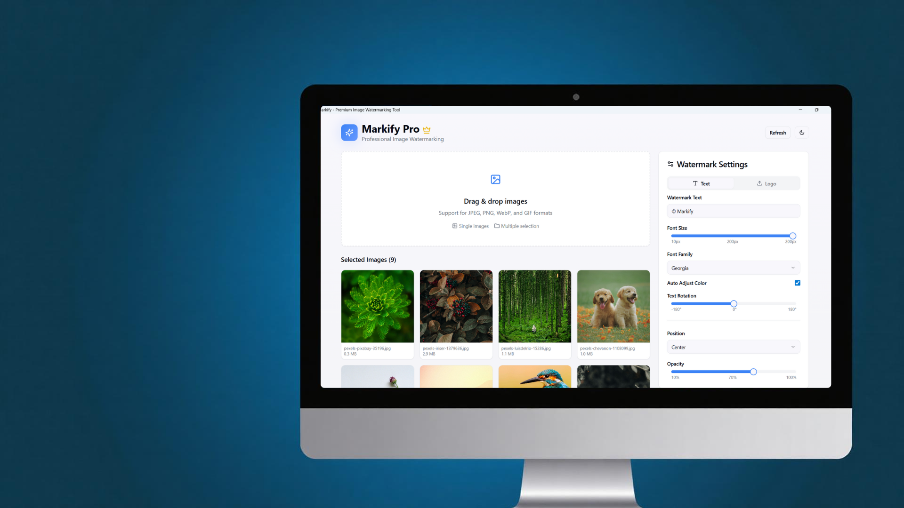

# Markify — Professional Watermarking Tool  

A **modern, responsive landing page** for **Markify**, a powerful watermarking solution designed to protect your digital content with customizable watermarks.



---

## 🚀 About Markify  

**Markify** is a watermarking solution built for **photographers, content creators, and businesses** who want to safeguard their digital assets with ease.  
It comes in **Free** and **Pro** versions, offering a streamlined, professional experience.

### ✨ Key Features  

- 🖼️ **Batch Processing** — Watermark multiple images at once  
- 🧩 **Custom Watermarks** — Add text or logo-based watermarks  
- 📍 **Flexible Positioning** — Place watermarks anywhere on your image  
- 🌫️ **Adjustable Opacity** — Control transparency to fit your aesthetic   
- 🏆 **High-Quality Output** — Preserve image quality after watermarking  

---

## 💰 Pricing Plans  

| Plan | Price | Features |
|------|--------|-----------|
| **Free** | ₹0 | Basic watermarking for personal use |
| **Pro** | ₹199 (one-time) | Lifetime access + advanced tools |
| | | - Unlimited batch processing<br>- Priority support<br>- Advanced positioning options<br>- Commercial license |

---

## 🛠️ Getting Started  

### 🧑‍💻 Edit Locally with Your Preferred IDE  

If you want to work locally and contribute, you can **clone this repository** and submit a pull request for your improvements.

> **Requirement:** Node.js & npm installed  
> [Install Node.js using nvm →](https://github.com/nvm-sh/nvm#installing-and-updating)

### ⚙️ Setup Steps  

```bash
# Step 1: Clone the repository
git clone https://github.com/Jaydip-Kamaliya/markify-bright-splash.git

# Step 2: Navigate into the project directory
cd markify-bright-splash

# Step 3: Install all dependencies
npm install

# Step 4: Start the development server
npm run dev
```

Your app should now be running at **http://localhost:8080** 🎉  

---

## 🧩 Tech Stack  

Markify is powered by a modern, fast, and type-safe web stack:

- ⚡ **Vite** — Lightning-fast build tool  
- 🧠 **TypeScript** — Type-safe JavaScript  
- ⚛️ **React 18** — Component-based UI with hooks  
- 💅 **shadcn/ui** — Beautiful, accessible UI components  
- 🎨 **Tailwind CSS** — Utility-first CSS framework  
- 🖋️ **Lucide React** — Icon library  
- 🧭 **React Router DOM** — Client-side routing  

---

## 🗂️ Project Structure  

```plaintext
src/
├── components/              # Reusable UI components
│   ├── ui/                  # shadcn-ui base components
│   ├── Hero.tsx             # Landing page hero section
│   ├── Features.tsx         # Features showcase
│   ├── HowItWorks.tsx       # Step-by-step guide
│   ├── DemoVideo.tsx        # Interactive demo video player
│   ├── PricingCards.tsx     # Pricing plans
│   ├── ComparisonTable.tsx  # Free vs Pro comparison
│   ├── UseCases.tsx         # Use case examples
│   ├── CTA.tsx              # Call-to-action section
│   └── Footer.tsx           # Page footer
├── pages/                   # Page components
│   ├── Index.tsx            # Main landing page
│   ├── FAQ.tsx              # Frequently asked questions
│   ├── PrivacyPolicy.tsx
│   └── TermsOfService.tsx
├── assets/                  # Static assets
│   ├── hero-mockup.jpg
│   └── markify-demo.mp4
└── lib/                     # Utility functions
```

## 🤝 Contributing  

Contributions are welcome! 🎉  
If you find bugs or have feature ideas, feel free to **open an issue** or **submit a pull request**.

---

## 📜 License  

This project is licensed under the **MIT License**.  


---

## 🌐 Connect  

- **Author:** [Jaydip Kamaliya](https://github.com/Jaydip-Kamaliya)  
- **Repository:** [Markify Bright Splash](https://github.com/Jaydip-Kamaliya/markify-bright-splash)  
- **Email:** jaydipkamaliya36@gmail.com  

---

> _“Protect your creativity, ”_
